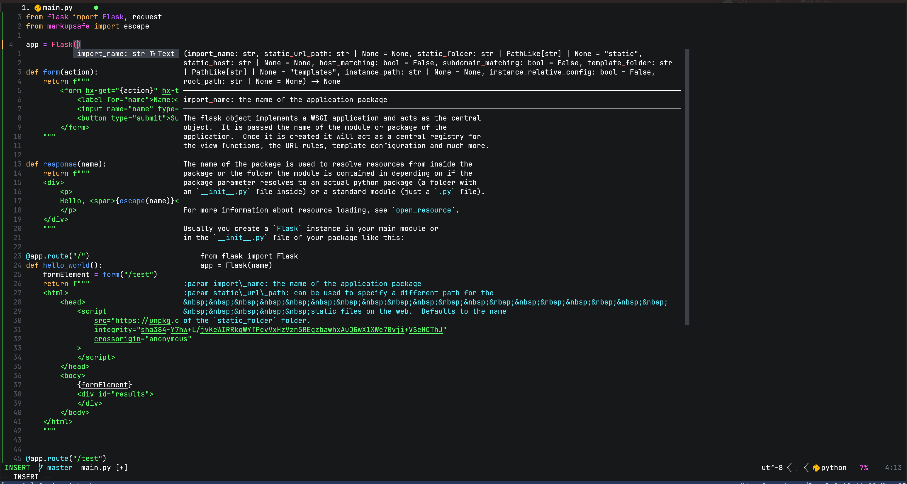
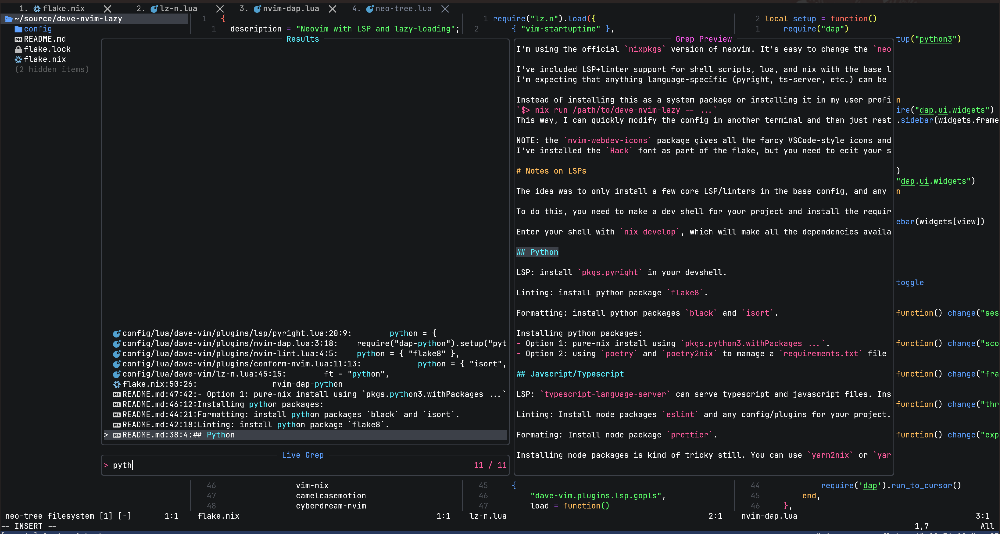
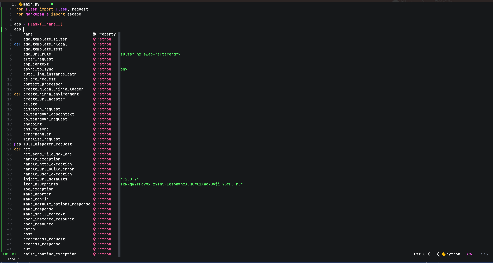

# My Neovim + LSP + Treesitter flake for Nix

My general-purpose neovim configuration, implemented as a [nix flake](https://nixos.wiki/wiki/flakes).

Uses lazy loading for most things, but I'm not trying to make startup time instant, just to not load the world for every language/LSP when they are not needed.
Some things had to happen at startup, like `cmp` and [`treesitter`](https://github.com/tree-sitter/tree-sitter).

LSP support from neovim's LSP functionality and [lsp-config](https://github.com/neovim/nvim-lspconfig):



[Telescope](https://github.com/nvim-telescope/telescope.nvim) with [ripgrep](https://github.com/BurntSushi/ripgrep) and [fzf](https://github.com/junegunn/fzf):



[Nvim-cmp](https://github.com/hrsh7th/nvim-cmp) for the autocomplete and snippets support:



Using [lz.n](https://github.com/nvim-neorocks/lz.n) as the lazy-loader implementation because it is simple and it works better for nix, because it doesn't include another package manager for plugins.

I think the lazy-loader config file is the new entry point for defining your configuration, and plugin-specific config modules make more sense than global `keys.vim`, `settings.vim`, etc.
I've started using a pattern of making lua modules for each plugin, and exposing a `lazy()` method that returns the plugin spec for the lazy-loader directly.
This lets me decompose the settings into local variables and functions and reduce the amount of nesting.

Plugin config module:

```lua
local lazy = function()
    return {
        "plugin-name",
        after = setup,
        event = event,
    }
end

return {
    lazy = lazy,
}
```

In the lazy-loader config:

```lua
require("dave-vim.plugins.nvim-lint").lazy(),
```

I've included LSP+linter support for shell scripts, lua, and nix with the base load-out, so they're always available for general purpose use, like for system administration tasks. Language-specific LSPs and other tools will need to be installed in some other way, and neovim will pick them up from the current environment.

> NOTE: the [`nvim-webdev-icons`](https://github.com/nvim-tree/nvim-web-devicons) package gives all the fancy VSCode-style icons and symbols, but requires a patched 'nerd font'.
I've installed the `Hack` font as part of the flake, but you need to edit your shell settings to use that new font after installing (or install another nerd font of your choice).

# Notes on LSPs

The idea was to only install a few core LSP/linters in the base config, and any projects can make [dev shells](https://nixos.wiki/wiki/Development_environment_with_nix-shell) and install the LSP/linter dependencies and neovim can just use them from the dev environment.

To do this, you need to make a dev shell for your project and install the required dependencies as `packages`.

Enter your shell with `nix develop`, which will make all the dependencies available, then run the nvim flake from that environment and neovim will be able to use them.

## Example: Python

LSP: install `pkgs.pyright` in your dev shell.

Linting: install python package `flake8`.

Formatting: install python packages `black` and `isort`.

```nix
pkgs.mkShell {
  packages = with pkgs; [
    pyright
    (python3.withPackages (
      p: with p; [
        debugpy
        isort
        black
        flake8
      ]
    ))
  ];
};
```

## Example: Javscript/Typescript

LSP: `typescript-language-server` can serve typescript and javascript files. Install node packages `typescript` and `typescript-language-server`.

Linting: Install node packages `eslint` and any config/plugins for your project.

Formatting: Install node package `prettier`.

```nix
pkgs.mkShell {
  packages = with pkgs; [
    yarn
    nodejs
  ];
};
```

```bash
yarn add eslint prettier typescript typescript-language-server
```

# OpenCode Integration

Comprehensive AI assistance integration using [OpenCode](https://opencode.ai) with 30 keybindings, specialized agents, and project-aware context.

## Quick Start

All OpenCode commands use the `,a` prefix (leader + a).

**Most Common Commands**:
- `,ae` - Explain code (at cursor or selection)
- `,af` - Find bugs
- `,ar` - Refactor code
- `,at` - Write tests
- `,aF` - Search files to add to context (Telescope)
- `,ag` - Review git diff

**Discovery**: Press `,a` and wait to see all 30 available commands in which-key popup (`,?`).

## Features

- **30 Keybindings**: Context prompts, file selection, session management, mode switching
- **Visual Mode Support**: Select code, then use `,ae`, `,af`, `,ar`, `,at`, `,ad`
- **Telescope Integration**: Multi-select files (`,aF`), grep code (`,aG`), buffers (`,aB`)
- **Neo-tree Integration**: Add files from tree view (`,aa` in Neo-tree)
- **3 Specialized Agents**: Nix expert, Neovim expert, Code reviewer (read-only)
- **Project-Aware**: Automatically loads coding standards from `.opencode/rules/`
- **Safety Controls**: Permission prompts for bash/write operations
- **Git Integration**: Review diffs before committing (`,ag`)

## Specialized Agents

Switch agents in OpenCode with `/agent` command:

- `/agent nix-expert` - Nix flakes, derivations, NixOS configuration
- `/agent neovim-expert` - Neovim APIs, lazy-loading, plugin development
- `/agent code-reviewer` - Security, performance, code quality (read-only)
- `/agent build` - Default build agent

## Documentation

- **[Keybinding Reference](docs/opencode-keybindings.md)** - Complete keybinding list
- **[Usage Guide](docs/opencode-usage.md)** - Workflows and examples
- **[Troubleshooting](docs/opencode-troubleshooting.md)** - Common issues and solutions

## Configuration

Located in `config/lua/dave-vim/plugins/opencode.lua`:
- Model selection (Claude Sonnet for complex, Haiku for simple)
- Permission system (ask before bash/write)
- TUI preferences (scroll speed, diff style)
- Context management (auto-compact, prune)
- Auto-update (notify-only for Nix compatibility)
- Instructions (auto-load README, .opencode/rules/)

## Project Standards

Coding standards automatically loaded from:
- `.opencode/rules/neovim.md` - Neovim/Lua best practices
- `.opencode/rules/nix.md` - Nix flake patterns
- `README.md` - Project context
- `CONTRIBUTING.md` - Contribution guidelines

OpenCode automatically follows these without manual reminders.
